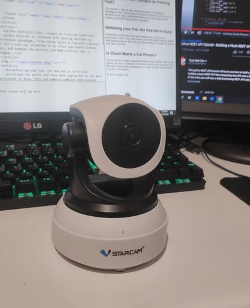
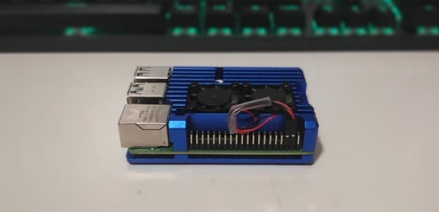
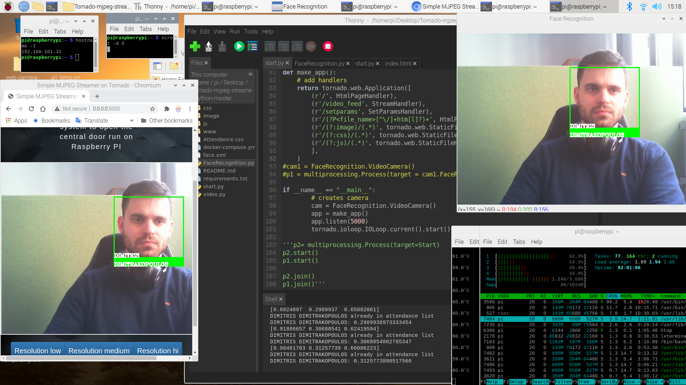

# Face Recognition-Attendance System
The whole app is written in Python 3.8.
It runs on a raspberry pi4.
The main algorithm proccesses every frame from the streamed video of an ip camera.
Then if there is human face in the frame it compares it with the stored images of our company employees.
If the recognized face is an employee it attends the time, date and name to a file.
Also the result of the video after the process is streamed to a web page where the user-administrator can access the attendance file, camera navigation and some more interesting stuff...

--A future implementation is to open the central door of the building with face recognition --

# Main-Devices
This project is implemented in a raspberry pi4 with 4GB of ram overclocked to 2GHz. @60 euros
The ip camera is a Vstarcam C7824Wip. @40 euros

# Some example photos 
 
 

 
